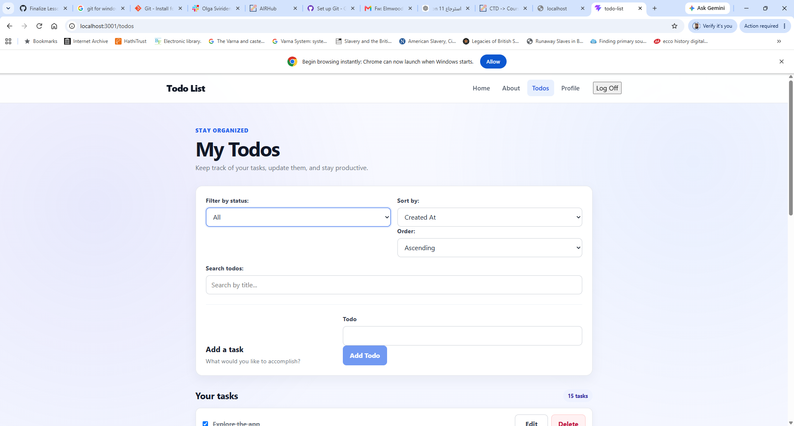
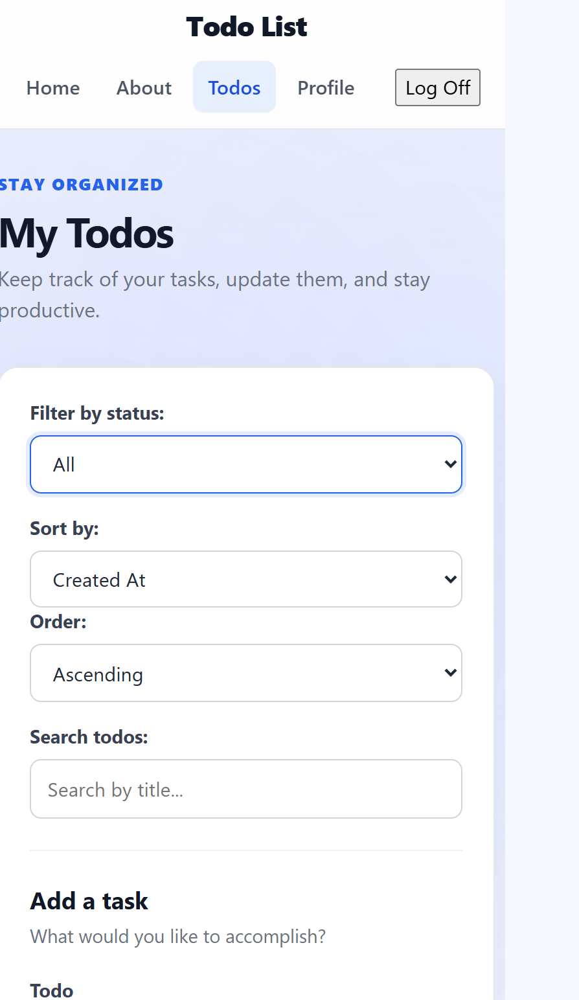

# Todo List

A responsive Todo List application built with React and Vite as part of the Code the Dream React curriculum.

The application allows authenticated users to create, view, complete, edit, delete, filter, search, and sort their todos through a clean and responsive interface.

## Live Demo

The application is deployed on Vercel.

**Live Application:** https://todo-list-dusky-five-93.vercel.app

## GitHub Repository

**GitHub Repository:** https://github.com/Noor-1994/todo-list

## Features

- User authentication and logout
- Protected Todos and Profile routes
- Create new todos
- Complete and uncomplete todos
- Edit existing todos
- Delete todos with confirmation
- Filter todos by:
  - All
  - Active
  - Completed
- Search todos
- Sort todos by available sort options
- Form validation
- Maximum todo title length of 100 characters
- Loading and error states
- Responsive design for desktop, tablet, and mobile screens
- Accessible form labels and keyboard focus states
- Custom error and delete confirmation UI
- 404 page for invalid routes

## Technologies Used

- React
- React Router
- Vite
- JavaScript
- CSS
- Context API
- useReducer
- ESLint

## Screenshots


### Desktop View



### Mobile View


## Project Structure

```text
src/
├── components/
├── contexts/
├── features/
├── pages/
├── reducers/
├── shared/
├── utils/
├── App.jsx
├── App.css
├── index.css
└── main.jsx
```

## Getting Started

### Prerequisites

Make sure you have Node.js and npm installed.

### Installation

Clone the repository and move into the project directory:

```bash
git clone https://github.com/Noor-1994/todo-list.git
cd todo-list
```

Install the dependencies:

```bash
npm install
```

### Development

Start the development server:

```bash
npm run dev
```

### Production Build

Create a production build:

```bash
npm run build
```

### Preview the Production Build

Run the production build locally:

```bash
npm run preview
```

## Available Scripts

- `npm run dev` — Starts the Vite development server.
- `npm run build` — Creates a production build.
- `npm run preview` — Runs the production build locally for testing.
- `npm run lint` — Checks the project for linting issues.

## Validation and Security

The application validates todo titles before submission.

Todo titles must:

- Contain at least one non-whitespace character
- Be no longer than 100 characters

The application provides user-friendly error messages without exposing internal system details.

The `.env` file is not tracked in Git.

## Responsive Design

The application was tested using Chrome DevTools at different screen sizes and orientations.

Testing included:

- Desktop
- Mobile
- Tablet
- Portrait orientation
- Landscape orientation

The layout was also checked for:

- Horizontal scrolling
- Readable text and spacing
- Touch-friendly controls
- Responsive navigation
- Responsive todo controls

## Accessibility

The application includes:

- Labels associated with form inputs
- Keyboard focus indicators
- Accessible navigation labels
- Appropriate button types
- Alert and status roles for feedback
- Touch-friendly controls

## Error Handling

The application provides user-friendly feedback when API requests fail.

Examples include:

```text
Unable to add this todo. Please try again.
Unable to update this todo. Please try again.
Unable to delete this todo. Please try again.
Unable to load your todos. Please try again.
```

The application also includes a custom confirmation dialog before deleting a todo.

## Navigation

The application includes the following routes:

- `/` — Home
- `/about` — About
- `/login` — Login
- `/todos` — Protected Todo List
- `/profile` — Protected Profile
- `*` — 404 Not Found

The Todos and Profile routes require authentication.

## Design Decisions

The application uses custom CSS to create a clean and consistent visual design.

The styling focuses on:

- Consistent spacing and typography
- Clear visual hierarchy
- Responsive layouts
- Card-based interface elements
- Accessible focus states
- User-friendly forms and controls
- Mobile and tablet usability

Additional design details are documented in `STYLE_DOCUMENTATION.md`.

## Development Notes

This project evolved throughout the React curriculum from a basic Todo List into a more complete application.

The project now includes:

- React component architecture
- React Router navigation
- Context-based authentication
- Reducer-based Todo state management
- API integration
- Form validation
- Responsive styling
- Error handling
- Security-focused practices
- Production build and preview testing

## Quality Checks

Final testing includes:

```bash
npm run lint
npm run build
npm run preview
npm audit
```

Linting and production build checks are used to verify code quality and ensure that the application can be built successfully.

Dependency audit results are reviewed separately so dependency changes are not applied automatically without checking their impact on the project.

## Final QA

The following functionality was tested:

- Add Todo
- Complete Todo
- Uncomplete Todo
- Edit Todo
- Delete Todo
- Filter by All
- Filter by Active
- Filter by Completed
- Search and filtering functionality
- Form validation
- Navigation
- Protected routes
- Authentication state after page refresh
- 404 page
- Error handling and user feedback
- Mobile responsive layout
- Tablet responsive layout
- Landscape layout
- Production build
- Production preview

## Future Improvements

Possible future improvements include:

- Add automated tests for critical components
- Add a dark/light theme toggle
- Add drag-and-drop todo reordering
- Continue improving accessibility
- Expand user profile functionality

## Portfolio Presentation

This project was completed as part of the Code the Dream React curriculum with an emphasis on:

- Professional visual design
- Responsive layouts
- Accessible interactions
- Secure input handling
- Clean component organization
- User-friendly feedback

## Demo Video

Lesson 11 requires a 3–5 minute video demonstration of the final application.

The demonstration includes:

- Login and authentication
- Navigation
- Creating todos
- Completing and uncompleting todos
- Editing todos
- Deleting todos
- Filtering and searching
- The application's styling and responsive layout
- The most challenging part of the project
- What was most enjoyable to work on

**Demo Video:** Coming soon
## License

This project is licensed under the MIT License.

It was created for educational purposes as part of the Code the Dream React curriculum.

## Contact

**GitHub:** https://github.com/Noor-1994